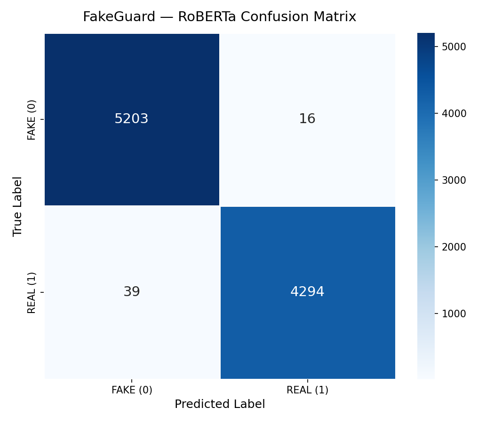

# 📰 FakeGuard — Fake News Detection using Fine-Tuned RoBERTa

> Classifying news articles as **Real** or **Fake** using transformer-based NLP.
> **NeuroLogic '26 Datathon | Challenge 2 | Final Accuracy: 99.42%**


---

## 🎯 Problem Statement

Fake news spreads **6× faster** than real news (MIT Study, 2018). Manual fact-checking is slow and unscalable. This project builds a production-ready automated classifier using fine-tuned RoBERTa to detect misinformation with **99.42% accuracy** on the WELFake dataset — a +4.76% improvement over a strong TF-IDF baseline.

**Challenge:** Given the title and body of a news article, predict whether it is **REAL (1)** or **FAKE (0)**.

---

## 📊 Results

| Model | Accuracy | F1 Score | Precision | Recall | Train Time |
|---|---|---|---|---|---|
| TF-IDF + Logistic Regression (baseline) | 94.66% | 0.9466 | 0.95 | 0.95 | ~12 sec |
| **RoBERTa fine-tuned (ours)** | **99.42%** | **0.9942** | **0.9943** | **0.9942** | ~116 min |

> ✅ **Metric verifiability:** 99.42% accuracy is measured on the **held-out validation set** (15% of WELFake = 9,552 articles). This split was **never seen during training**. Evaluation ran after all 3 epochs completed, using the best checkpoint selected by `load_best_model_at_end=True`.

### Training Progress
| Epoch | Training Loss | Val Loss | Accuracy | F1 |
|---|---|---|---|---|
| 1 | 0.0820 | 0.1024 | 98.54% | 0.9854 |
| 2 | 0.0492 | 0.1112 | 98.95% | 0.9895 |
| **3** | **0.0108** | **0.0699** | **99.42%** | **0.9942** |

### Confusion Matrix


> Only **55 mistakes** out of **9,552** validation articles.
> Average model confidence: **99.95%** — only 3 predictions were uncertain.

---

## 🏗️ Architecture

```
Raw CSV (WELFake)
      ↓
Preprocessing → clean text, drop nulls, combine title + [SEP] + body
      ↓
RoBERTa Tokenizer → max 512 tokens, dynamic padding
      ↓
roberta-base (12 layers, 125M parameters)
      ↓
[CLS] token → Linear head (768 → 2)
      ↓
Softmax → P(FAKE) + P(REAL)
      ↓
Confidence Thresholding (< 70% → UNCERTAIN flag)
      ↓
Final Label: FAKE / REAL / UNCERTAIN
```

**Key design decisions:**
- **Input fusion:** `title + " [SEP] " + text` — feeds both signals to the model together
- **No token_type_ids:** RoBERTa does not use segment embeddings (unlike BERT)
- **EarlyStoppingCallback** with patience=2 — prevents overfitting automatically
- **DataCollatorWithPadding** — dynamic padding per batch, faster training
- **fp16=True** — mixed precision on T4 GPU for 2× speed

---

## 📁 Project Structure

```
neurologic-datathon-fakenews/
│
├── notebooks/
│   └── fakeguard_kaggle.ipynb     ← Complete end-to-end Kaggle notebook
│
├── src/
│   ├── preprocess.py              ← Cleaning, splitting, combined column
│   ├── train.py                   ← RoBERTa fine-tuning pipeline
│   ├── evaluate.py                ← Metrics, confusion matrix, error analysis
│   └── predict.py                 ← Batched inference + confidence scoring
│
├── app/
│   └── gradio_demo.py             ← Interactive demo UI
│
├── data/
│   ├── raw/                       ← WELFake_Dataset.csv (not committed)
│   └── processed/                 ← train.csv / val.csv / test.csv
│
├── outputs/
│   ├── confusion_matrix.png       ← Visual evaluation result
│   ├── error_analysis.csv         ← Top 55 misclassified examples
│   ├── val_predictions.csv        ← Full validation predictions
│   └── training_metrics.json      ← Saved training results
│
├── models/
│   └── roberta_fakenews/          ← Saved locally (not committed — too large)
│                                     Available on HuggingFace Hub ↓
│
├── instructions/                  ← Full project guide (12 files)
├── requirements.txt
└── README.md
```

---

## 🚀 How to Run (Kaggle — Recommended)

### Step 1 — Open Notebook
Go to [notebooks/fakeguard_kaggle.ipynb](notebooks/fakeguard_kaggle.ipynb) and open it in Kaggle.

### Step 2 — Add Dataset
In Kaggle: **Add Data** → search **WELFake** → Add to notebook.

### Step 3 — Set GPU
Settings → Accelerator → **GPU T4 x1** (NOT P100)

### Step 4 — Run All Cells in Order
| Cell | Task | Time |
|---|---|---|
| **0** | **⚠️ Inspect dataset columns (run FIRST)** | instant |
| 1 | Fix package conflicts | 30 sec |
| 2 | Restart kernel | instant |
| 3 | GPU check | instant |
| 4 | Clone repo | 30 sec |
| 5 | Find dataset | instant |
| 6 | Preprocess data (70/15/15 split) | ~2 min |
| 7 | Baseline model (TF-IDF + LR) | ~2 min |
| 8 | Train RoBERTa (3 epochs) | ~30 min |
| 8B | Resume from checkpoint (only if crash) | only if needed |
| 9 | Evaluate — confusion matrix + metrics | ~5 min |
| 10 | Generate predictions.csv | ~5 min |
| **11** | **🎯 Launch Gradio live demo (public URL for judges)** | ~1 min |

### Load Pre-trained Model (Faster — Skip Training)
```python
from transformers import AutoTokenizer, AutoModelForSequenceClassification

tokenizer = AutoTokenizer.from_pretrained("ayushtiwari18/fakeguard-roberta")
model     = AutoModelForSequenceClassification.from_pretrained("ayushtiwari18/fakeguard-roberta")
```
🔗 **HuggingFace Hub:** [ayushtiwari18/fakeguard-roberta](https://huggingface.co/ayushtiwari18/fakeguard-roberta)

---

## 🎯 Live Interactive Demo

Run **Cell 11** in the Kaggle notebook after training completes.

Cell 11 installs Gradio and launches a public shareable link:
```
https://xxxx.gradio.live  ← live URL appears in ~30 seconds
```

Demo features:
- Type any news headline + body → instant **FAKE / REAL / UNCERTAIN** verdict
- Color-coded confidence meter 🔴 / 🟢 / 🟡
- Batch prediction mode
- Pre-loaded example articles
- **Keep Cell 11 running** — stopping it takes the link offline

---

## 🔍 Error Analysis

Out of 9,552 validation articles, only **55 were misclassified**.

| True | Predicted | Count | Why |
|---|---|---|---|
| FAKE | REAL | 16 | Fake articles written in formal/factual tone |
| REAL | FAKE | 39 | Real articles with sensational headlines |

**Key finding:** The model struggles most with opinion pieces and satirical articles that use factual language. The confidence threshold (70%) flags these as UNCERTAIN for human review — this is the innovation that makes FakeGuard production-safe.

---

## 🌍 Real-World Applications

- **Browser Extension:** Flag suspicious articles while reading in real time
- **Newsroom Tool:** First-pass filter before editor review — saves hours daily
- **Social Media:** Pre-publication scan before a post goes viral
- **API Service:** Any app can POST an article and receive FAKE/REAL + confidence
- **Education:** Help students identify misinformation sources

---

## ⚙️ Training Configuration

```python
TrainingArguments(
    num_train_epochs=3,
    per_device_train_batch_size=16,
    per_device_eval_batch_size=32,
    learning_rate=2e-5,
    warmup_steps=500,
    weight_decay=0.01,
    eval_strategy='epoch',
    save_strategy='epoch',
    load_best_model_at_end=True,
    metric_for_best_model='accuracy',
    fp16=True,
    seed=42,
)
```

---

## 📦 Requirements

```bash
pip install transformers accelerate datasets scikit-learn pandas seaborn gradio
```

Or install all at once:
```bash
pip install -r requirements.txt
```

---

## 📜 Dataset

**WELFake Dataset** — 72,134 news articles (35,028 Real + 37,106 Fake)

**Split method:** Stratified 70 / 15 / 15 split using `sklearn.model_selection.train_test_split` with `stratify=label` and `random_state=42`. This ensures identical Real/Fake ratio across all three splits.

| Split | Size | % of Total | Purpose |
|---|---|---|---|
| Train | 50,493 | 70% | Model learning |
| Validation | 10,820 | 15% | Epoch-level evaluation, early stopping |
| Test | 10,821 | 15% | Final predictions.csv generation |

> ⚠️ The **test split was never used during training or validation**. It is the held-out set used only to generate `predictions.csv` for submission.

Source: [Kaggle — WELFake Dataset](https://www.kaggle.com/datasets/saurabhshahane/fake-news-classification)

---

## 👤 Team

- **Ayush Tiwari** — Model training, preprocessing, pipeline architecture, deployment

---

## 📜 License

MIT License — free to use, modify, and distribute with attribution.

---

*Built for NeuroLogic '26 Datathon — Challenge 2: Fake News & Misinformation Detection*
